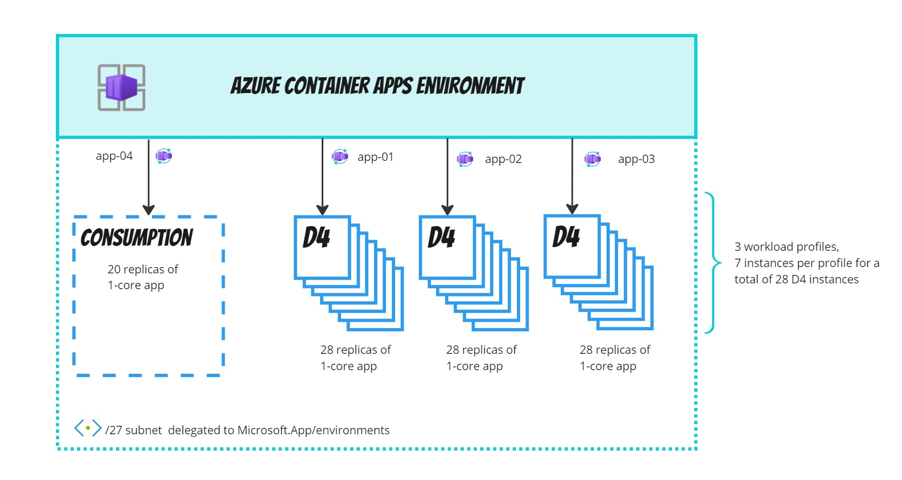
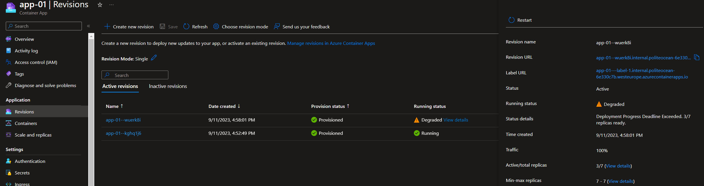

# Azure Container Apps workload profiles

## Scenario 1

The scenario 1 deploys :
- 3 dedicated-workloads D4
    - every profile has 7 instances (no scale, min=max)
- 1 consumption-workload
- 28 replicas of 1-core app per dedicated-profile (4 app per node) to reserve all the available CPU resource
- 20 replicas of 1-core app in the consumption profile



## Scenario 2

The scenario 2 deploys :
- 1 dedicated-workload D4 profile with 2 instances
- 5 replicas of 1-core app to reserve the 62% of the total available CPU

Scaling the app (deployment) from 5 to 7 instances result in a situation where the traffic is routed to the new replica that is partially activated.



The Degraded state can be fixed with the following commands

```
# deactivate the old replica
az containerapp revision deactivate --revision "app-01--kghq1j6" --resource-group rg-heyrevision

# activate the (already active) new replica
az containerapp revision activate --revision "app-01--wuerk8i" --resource-group rg-heyrevision
```

